# Matchingtune - PROJETO 3º SEMESTRE 

Desenvolvido por: Kira Sousa (20231205), Silésio Pipa (20220618), Yosvany Nunes (20230853)

# Nome do projeto: _MatchingTune_
#Música #Match #Aplicação #Pessoas #Eventos #Comunidade #Arredores #A Acontecer #Amigos
## **Uma proposta inicial de projeto:**
O _MatchingTune_ é um aplicativo onde se criam conexões a partir dos gostos musicais do utilizador. 
Conectando uma plataforma de streaming de música (_Spotify_, _YouTube Music_, _AppleMusic_, _SoundCloud_),
o _MatchingTune_ encontra utilizadores perto do usuário e em escala global, que ouçam as mesmas músicas, 
mesmos artistas e estilos de música. O _MatchingTune_ notifica também o utilizador de eventos perto de si. 
Sejam artistas que ouve ou de estilos de música semelhante ao que ouve, recomendando assim eventos que possam 
ser do interesse do utilizador.

##  Enquadramento do projeto
O _MatchingTune_ pretende juntar os vários amantes da música entre eles a partir dos seus próprios gostos. Utilizando um algoritmo de associação entre utilizadores a partir das suas músicas guardadas, artistas ouvidos e playlists criadas. Num mundo onde cada vez mais a música se aproxima dos ouvintes, especialmente por concertos, o _MatchingTune_ indica também ao utilizador sobre eventos de música que podem ser do interesse do utilizador. Estas sugestões são feitas a partir dos eventos anunciados pelos artistas ouvidos e seguidos pelo utilizador e/ou também eventos perto do utilizador de estilos de música que este ouve.  

  A grande preocupação de jovens de hoje em dia é a união com outros com gostos e opiniões em comum. O _MatchingTune_ serve de plataforma que cria esta associação entre utilizadores para facilitar o caminho desafiante que este problema moderno apresenta aos jovens da atualidade. O objetivo principal do _MatchingTune_ é unir comunidades graças à música. Seja a união entre artistas e as suas respetivas comunidades, seja entre as comunidades entre si.
Apesar do desafio que o _MatchingTune_ pretende ultrapassar ser mais direcionado aos jovens, qualquer pessoa tem liberdade de utilizar a aplicação. ***É obrigatório para utilizadores menores de 18 anos terem a sua idade exposta no perfil.*** Apesar do _MatchingTune_ não ser diretamente concebida como uma aplicação de encontros românticos, é essencial manter a segurança dos utilizadores mais novos para impedir o contacto com possíveis predadores, por isto, todas as sugestões feitas a utilizadores menores de 18, serão estritamente com outros utilizadores menores de 18 (Uma possível funcionalidade seria a de verificação de idade a partir do cartão de cidadão, para qualquer idade, e não exclusivamente para maiores de 18 anos). Com exceção da proteção de menores na aplicação, o _MatchingTune_ não possuí nenhuma ferramenta para selecionar "filtros de interesse" para as sugestões de utilizadores feitas na aplicação. Ou seja, os únicos filtros existentes são apenas os gostos musicais em comum e se é maior ou menor de idade.

  Após uma extensa pesquisa, foi confirmado a existência de aplicações semelhantes ao _MatchingTune_ no seu conceito. No entanto, estas não estão disponíveis em Portugal, com a exceção do _TuneMeet_. Apesar disto, o _TuneMeet_ não só não é uma aplicação, mas sim um site, como apenas faz associações pela música atual que se está a ouvir, ou as cinco mais ouvidas. Sem ter em consideração a localização dos utilizadores, nem toda as suas músicas gostadas. Outras aplicações relevantes a mencionar são todas as plataformas de streaming que o _MatchingTune_ vai buscar as suas informações. A aplicação _Spotify_, apesar de não criar associações entre utilizadores, faz associações de eventos. Tendo na página de procura, uma opção para eventos ao vivo. Onde sugere eventos dos artistas que o utilizador ouve. Aparece também no perfil de artista

##  Project Charter and WBS (Documentação a explicar as várias funcionalidades):
O objetivo principal deste projeto, é conseguir criar uma aplicação capaz de comparar informações sobre duas contas diferentes. Ou seja, o objetivo core é aceder aos dados de uma conta de uma plataforma de music streaming e comparar a uma outra conta também de music streaming. Queremos que esta comparação seja feita entre duas contas independente da plataforma de streaming que são (queremos conseguir comparar os conteúdos de uma conta, por exemplo, do _Spotify_ com uma conta que pode tanto ser da mesma plataforma de streaming ou de uma diferente, _SoundCloud_, _Youtube Music_, etc). Para isto ser possível, é preciso não só teremos de ter acesso aos dados e informações das respetivas plataformas de streaming, como é preciso criar algoritmos de comparação entre as músicas guardadas pelos utilizadores, as playlists e os artistas ouvidos. Depois de termos acesso a estas informações, o algoritmo vai comparando música a música, para ver se estas são equivalentes (a partir do nome da música, artista, duração e género). Caso sejam iguais, o algoritmo deve guardar esta informação e adicionar mais 1 valor à variável de músicas em comum entre utilizadores. 

O algoritmo de comparação entre artistas apesar de funcionar de forma semelhante ao algoritmo de músicas, tem uma componente de ordenação. Não só o algoritmo deve assinalar quando os utilizadores têm algum artista em comum como deve guardar quais as músicas desse artista que ambos têm guardadas. Ordenando os artistas ouvidos por ambos desde o que tiverem mais músicas em comum até ao que tiverem menos. Para evitar excesso de artistas em comum, um artista apenas é considerado artista comum se tiverem mais de 3 músicas guardadas em comum ou, caso o artista não tenha mais de 3 músicas, se ambos tiverem 66% das músicas do artista em comum (2 músicas ou 3). 

O usuário pode escolher quais as variáveis que pretende que sejam comparadas com outros utilizadores. Estas variáveis podem ser músicas guardadas, músicas mais ouvidas, artistas ouvidos, artistas favoritos, playlists guardadas, playlists mais ouvidas e géneros de música ouvidos ou só os mais predominantes. Portanto, um utilizador pode escolher apenas receber matches com pessoas com as mesmas músicas mais ouvidas, fazendo com que todas as outras matches sejam consideradas menos relevantes e consequentemente apareçam mais baixo na listas de sugestões de utilizadores. 

Para uma match entre utilizadores ser considerada uma boa match e, consequentemente, notificar o utilizador da existência desta, é preciso que os utilizadores tenham pelo menos 30% de compatibilidade por default (Esta percentagem pode ser alterada para mais ou para menos, dependendo de a partir do quanto porcento o utilizador pretende ser informado por notificação, podendo mesmo sendo desativado por completo as notificações de match). Por outras palavras, é preciso que o utilizador que foi comparado ao usuário tenha, pelo menos, 30% das músicas guardadas pelo usuário também guardadas nas suas plataformas de streaming (não precisa de ser necessariamente apenas uma das contas, pode ser nas várias plataformas de streaming associadas sempre retirando as músicas que estiverem duplicadas por estarem guardadas em mais do que uma das plataformas de streaming). Utilizadores com menos percentagem de compatibilidade com o usuário, serão também considerados matches mas apareceram como tendo menos prioridade e não notificaram o utilizador da sua existência. Isto é, o usuário não receberá a informação por notificação sobre esta match mas aparecerá nas opções de matches existente no ecrã principal. Quanto mais baixa a compatibilidade, mais baixo na lista de sugestões se encontrará.

A ordem de utilizadores sugeridos é baseado não só na percentagem de compatibilidade como na localização associada a este. Isto é, sendo o usuário de lisboa, por exemplo, um utilizador com 40% de compatibilidade também de Lisboa, aparecerá primeiro que um utilizador do porto com 55% de compatibilidade. Esta definição poderá também ser alterada para a localização ter um maior ou menor efeito nas sugestões, dependendo sempre da preferência do utilizador.

Para além do objetivo core do projeto, a aplicação procura também mostrar ao utilizador, a partir da localização deste, o que as pessoas ao seu redor estão a ouvir no exato momento e, como feature que gostaríamos de implementar se possível, qual plataforma estão a utilizar. No mesmo ecrã onde estariam os "Nearby Listeners", iriam também estar o que os utilizadores que o usuário segue, estão a ouvir e, à semelhança do anterior, qual plataforma estão a utilizar, se possível. É neste mesmo ecrã que apareceriam as matches feitas pelo sistema. Estas matches, teriam do seu lado esquerdo, uma pequena cruz que serviria de botão de "Não Interessado" que, uma vez pressionado, identificaria o perfil correspondente da match como sem interesse e deixaria de aparecer nas sugestões de utilizadores. Isto não impede do perfil de aparecer nos "Nearby Listeners" ou de aparecer no sistema de procura de utilizadores.

O sistema de procura de utilizadores funciona à semelhança de qualquer um dos já existentes nas redes sociais. Existe uma barra de busca onde se mete o nome do utilizador que se pretende encontrar e vai se a procura na base de dados de correspondências. Na página de eventos também haveria uma barra igual mas para procura de eventos a partir do nome de artistas, cidades e datas. Ou seja, o utilizador pode procurar sobre eventos existentes não só pelo seu nome, como pelos artistas performativos, locais específicos ou pelas datas dos eventos. 

Na página de eventos, aparecem eventos sugeridos ao usuário seja por serem eventos de artistas que ouve, estilos de música que gosta e/ou por proximidade. Semelhante ao que já existe nas matches, do lado esquerdo do evento tem um botão de "Não Interessado", que uma vez pressionado, identifica o evento como sem interesse para o utilizador e desaparece das sugestões de eventos. Isto não impede o evento de aparecer como sugestão caso seja procurado por informações correspondentes (nome, datas, artistas, locais). Apenas não aparecerá juntos aos eventos que são sugeridos ao utilizador pelo algoritmo.

Por fim, existe uma página de perfil, onde o utilizador pode adicionar uma imagem de perfil, um nome de usuário, mostrar quais as suas redes socias e plataformas de streaming associadas e quais informações a nível musical que pretende mostrar. Por exemplo, um utilizador pode escolher mostrar apenas quais os seus artistas mais ouvidos e não as suas músicas preferidas. Também é possível ocultar completamente estas informações do perfil sem tendo nenhum efeito para o algoritmo de matching. Ao associar as contas das redes sociais, estas aparecerão no perfil do utilizador através do ícone da aplicação da rede social que quando pressionado redireciona o utilizador para o perfil na aplicação ou site da rede social. Caso o utilizador não queira que esta informação apareça no seu perfil, teria de apagar esta associação por completo da conta. Preferencialmente, gostaríamos que o utilizador conseguisse manter associado as suas redes sociais na sua conta sem ter de as expor no seu perfil.

Ao associar as redes sociais e plataformas de streaming, o usuário não só conseguiria procurar por amigos mútuos destas plataformas como estes amigos mútuos lhe seriam sugeridos para seguir (não como match mas como amigo mútuo em outra plataforma) e o usuário seria também sugerido a estes. O usuário pode escolher desligar esta feature para apenas poder ter a rede social exposta no seu perfil.

###  Requisitos funcionais e não funcionais:
**Requisitos Funcionais:**
>- Criação de Conta;
>
>- Inicio de Sessão;
>
>- Recuperação de Password;
>
>- Edição de Perfil (Imagem, nome de usuário, redes socias associadas/aparecem no perfil);
>
>- Edição de Conta (Alteração de email, alteração de password, plataformas de streaming associadas, redes socias associadas, estilo de localização(Fixa ou dinâmica), Dados Pessoais, Privacidade);
>
>- Procura de Usuários;
>
>- Ver perfil de usuários;
>
>- Seguir Usuário;
>
>- Aceitar Match;
>
>- Recusar Match;
>
>- Bloquear Usuário;
>
>- Visitar Redes Sociais do Usuário (É redirecionado para a aplicação ou para o site do perfil do utilizador).

**Requisitos não Funcionais:**
>- Comparação entre Usuários (Idade (maior ou menor de idade), comparação das músicas gostadas, artistas ouvidos, playlists e álbuns salvos);
>
>- Mostrar Músicas e Artistas favoritos no perfil;
>
>- Buscar informações às plataformas de streaming;
>
>- Mostrar as músicas que estão a ser ouvidas e o timestamp destas dos vários usuários;
>
>- Fazer sugestões de Usuários (Matches);
>
>- Fazer sugestões de Eventos (Baseado na localização, estilos de música do usuário, artistas ouvidos pelo usuário);
>
>- Rastreamento de localização;
>
>- Reunir informações sobre eventos.

###  Planificação (Gráfico de Gantt):

##  Study Cases:
- **Personas**

>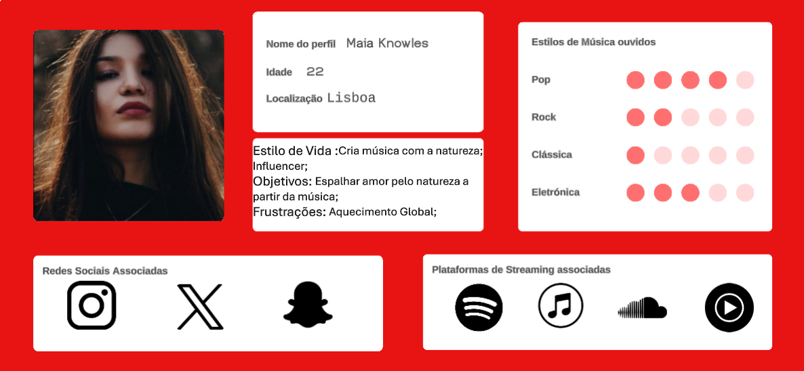
>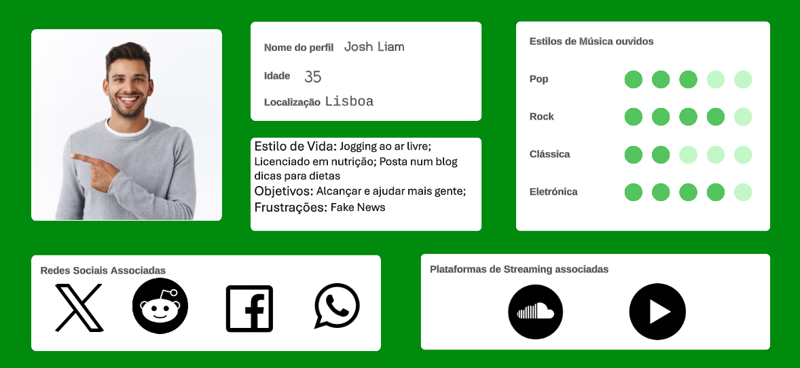
>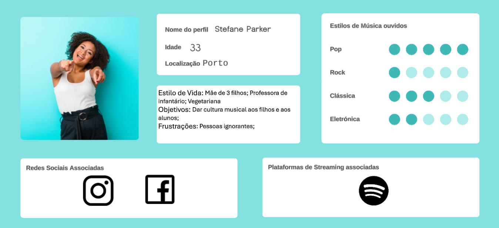

 - **1 caso de utilização que descreva o objeto "core" do projeto:**

> A persona Maia Knowles cria conta na aplicação a partir do email. Após criar uma conta e criar a respetiva password, a pessoa volta para a página de Login onde pode agora iniciar sessão com a conta criada. Ao iniciar sessão, a aplicação sugere a adição de informações ao perfil, como o associar das contas nas várias plataformas de streaming, associar redes sociais ao seu perfil, adicionar imagem de perfil e a localização. O usuário escolhe agora associar 3 contas de 3 redes sociais (_X_, _Instagram_ e _Snapchat_) e 4 contas de plataformas de streaming (_Spotify_, _Apple Music_, _SoundCloud_ e _Youtube Music_). O usuário adiciona também a sua localização em modo dinâmico. Ao associar as contas de plataformas de streaming, a aplicação inicia o algoritmo de matching. O usuário vai para a página principal, onde aparece o que os usuários perto de si estão a ouvir, o que as pessoas que segue estão a ouvir e as matches com outros usuários com gostos musicais semelhantes. A primeira match é com o usuário Josh Liam, que é de Lisboa e que tem gostos semelhantes aos de Maia nos géneros de música Pop e Eletrónica. Josh tem cerca de 256 músicas em comum com Maia e 12 artistas que ambos ouvem. Maia clica na imagem de Josh, que a leva ao perfil deste e carregar no botão de seguir usuário. O usuário depois clica no ícone da rede social _X_ que a redireciona para o perfil de Josh na aplicação _X_. Retornando à aplicação MatchingTune, o usuário carrega no ícone para ir para a página principal onde tem outra match sugerida a este. Desta vez é com o usuário Stefane Parker, do Porto, que tem uma grande compatibilidade com Maia no estilo de música Pop, com mais de 627 músicas em comum e 34 artistas ouvidos por ambas. O usuário clica na cruz de não interessado e o perfil de Stefane Parker fica marcado como sem interesse e a match desaparece.
 
 - **Outros 2 casos de utilização diferentes do "core" e entre eles:**

> A persona Stefane Parker, já com conta criada e plataformas de streaming associadas, vai à página de eventos onde lhe aparece a sugestão de um recital de música clássica no Centro Comunitário do Monte Pedral no dia 18 de Outubro às 21 horas. Ao lado da sugestão tem um botão que diz comprar bilhetes onde após o usuário clicar, é redirecionado para o site de venda de bilhetes do evento. Retornando à aplicação, o usuário vê outra sugestão de evento, desta vez de um artista que ouve. É um concerto dos The Script no MEO Arena, dia 14 de março às 20 horas da noite. Onde deveria estar o botão para comprar bilhetes, está em vermelho e em letras maiúsculas "ESGOTADO". O usuário clica na cruz do lado oposto e o evento fica marcado como sem interesse e desaparece das sugestões.

> A persona Josh Liam, já com conta criada e plataforma de streaming associadas, vai à página principal onde aparecem as matches com outros usuários, o que os usuários que segue estão a ouvir e o que as pessoas à sua volta estão a ouvir. O usuário, quando escolheu as suas opções de localização, escolheu localização fixa, ou seja, não permitiu que a aplicação obtivesse a sua localização e optou por estar sempre localizado no mesmo sítio, numa posição genérica. Isto é, a sua localização estava como sendo Lisboa na sua totalidade. Tendo esta feature ativa, o usuário não aparece nas páginas principais como estando nas redondezas mas também não lhe aparecem usuários que estejam realmente perto dele mas sim na localização de lisboa de uma forma geral. O utilizador caso queira aparecer na página inicial de outros usuários, tem de escolher uma posição exata para a sua localização (não sendo necessariamente algum local em que tivesse estado) ou alterar para posição dinâmica. O usuário decide alterar para um ponto exato a sua localização, os usuários que serão considerados como estando nas redondezas continuaram a ser os mesmos utilizadores que apareciam antes. Caso o usuário queira ver o que os usuários de uma específica zona estão a ouvir, tem de estar nessa zona específica e ativar a localização dinâmica. Não é possível ver o que os utilizadores de uma certa área estão a ouvir a não ser que se esteja naquela área com a localização dinâmica ativa.

##  Modelo do domínio:

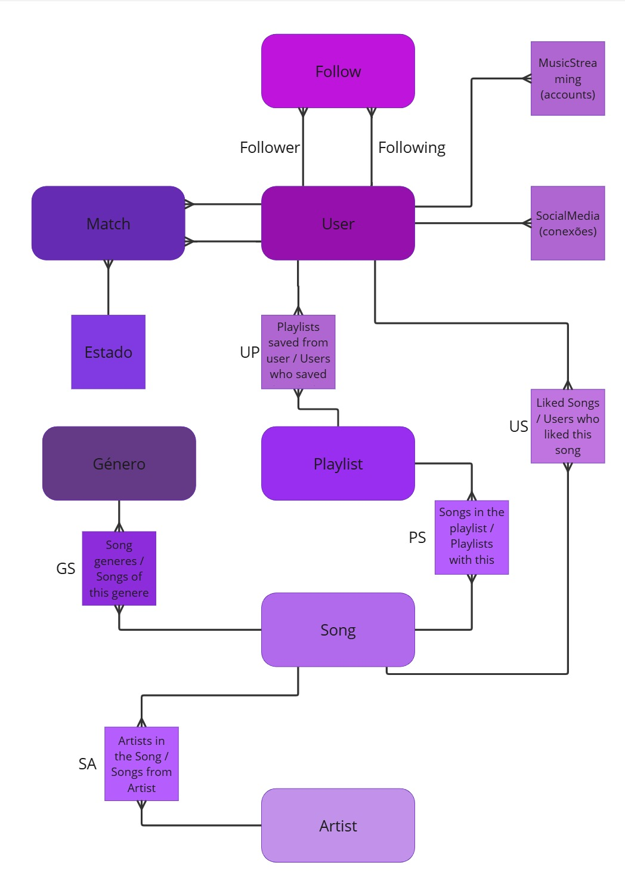

##  Mockups e interfaces:

### Log In

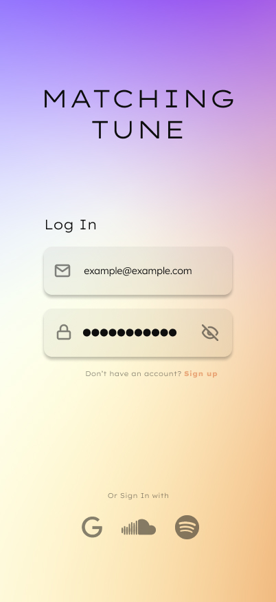
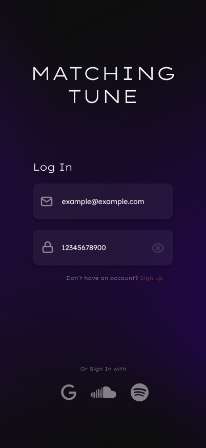
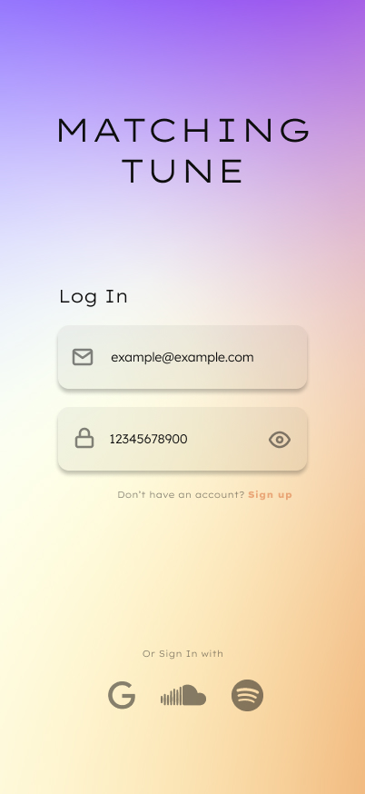

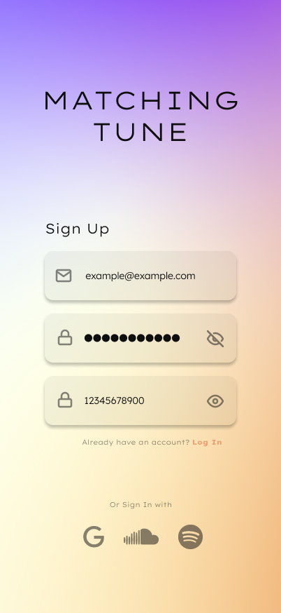

### Loading Screen

### Home Page

### Match Profile
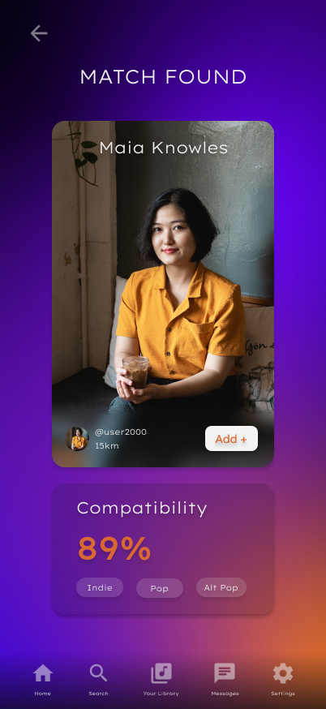

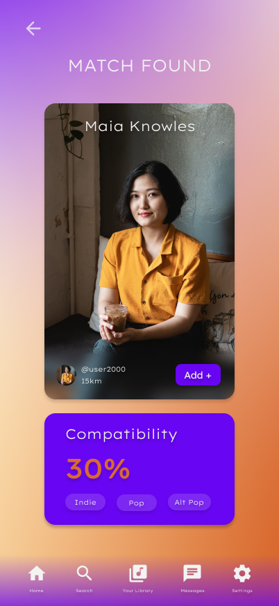

### Nearby Matches

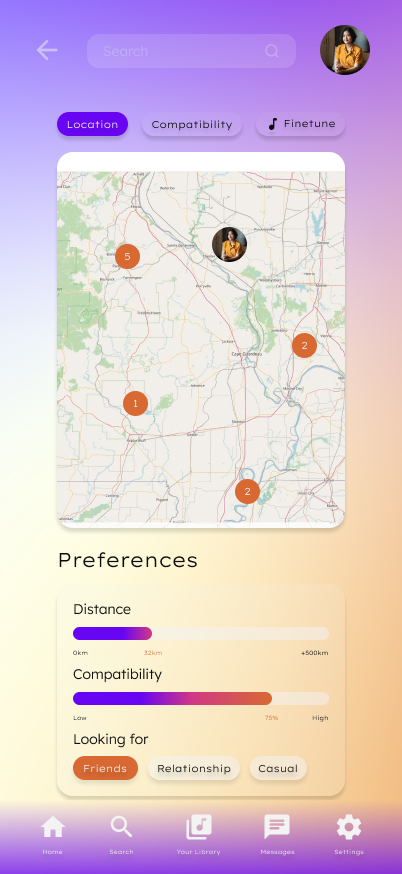

### Perfil
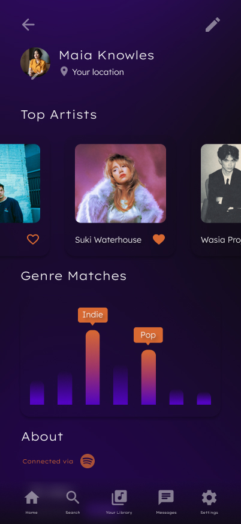

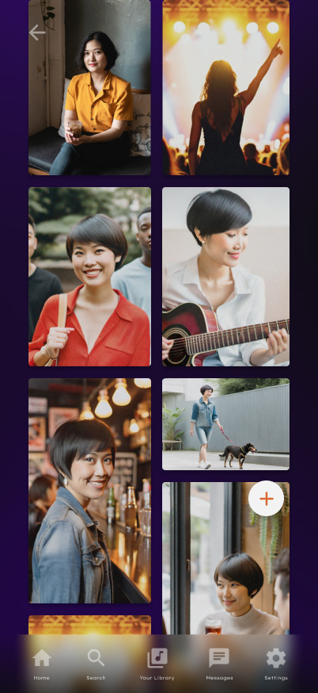

### Eventos

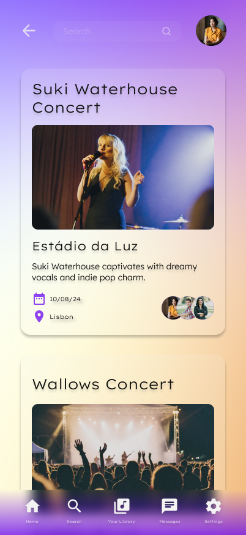

## Solução a implementar:
Este projeto, contempla várias bases esseciais para ser concebido. O mais óbvio a realçar é o da aplicação em si. O _MatchingTune_ visa ser uma aplicação móvel feita em _Android Studio_ utilizando o Kotlin e Jetpack Compose. É também necessário a criação de um servidor em Spring Boot para servir de suporte à Base de Dados que é responsável pelo armazenamento das informações e dados dos utilizadores. Relativamente à unidade curricular de matemática discreta, tem-se o desenvolvimento da componente de processamento e análise dos dados recolhidos pela aplicação para depois estes dados serem usados para o algoritmos de comparação para matching. Os vários relatórios, vídeos e apresentações em geral do projeto, têm como suporte a disciplina de competências comunicacionais, que visa fazer com que estas apresentações atinjam os seus potenciais máximos.

### Permissões requisitadas:

- **Localização:** para poder encontrar eventos perto do usuário é preciso ter acesso a localização deste. O _MatchingTune_ mostra também o que as pessoas à volta do utilizador estão a ouvir. É preciso também trabalhar com o mapa, uma vez que solicitamos o lugar do evento, temos também que ter acesso eventos em tempo real ou simulado;   

- **Notificações:** Para o recurso de notificação de eventos funcionar bem, seria importante integrar informações de forma precisa e atualizada sobre shows, festivais e eventos locais, o que pode exigir integração com múltiplas fontes; 

- **Contatos:** Existe também a funcionalidade de associar contatos e comparar gostos musicais entre estes. Sendo por isso necessária a permissão do utilizador para aceder aos seus contatos telefónicos e também a permissão para os seus contatos poderem ter acesso a esta funcionalidade sobre o usuário;

- **Redes Socias:** À semelhança dos contactos, o utilizador consegue encontrar amigos mútuos das redes sociais, na aplicação, ao associar estas. Fica também disponível, para os outros utilizadores, a possibilidade de serem redirecionados para o perfil destes nas respetivas redes sociais.

- **Plataforma de Streaming:** Para aplicação alcançar o seu objetivo core, o usuário precisa de pelo menos associar uma plataforma de streaming de música para o algoritmo de matching poder funcionar. É possível conectar mais que uma conta de plataformas de streaming, o algoritmo de matching fará uma comparação entre as várias contas associadas para reúnir todas as músicas, artistas, playlists e géneros de música ouvidos e compilar num só registo, que será posteriormente utilizado para fazer matches com outros utilizadores.

## Tecnologias a utilizar (podem vir a ser provisórias):
- Android Studio Koala Feature Drop - para ambiente de desenvolvimento da aplicação Android;

- Visual Studio Code - como ambiente de desenvolvimento do servidor em Java;

- My SQL Workbench - para modulação da Base de Dados;

- MAMP - como servidor provisório de suporte à base de Dados;

- Figma - como ambiente de desenvolvimento da interface gráfica (realizado por designer externo);

- Github - para gestão de versões e documentação do projeto;

- Clickup - para gestão do projeto;

- Discord - como plataforma de comunicação principal de suporte ao projeto.

## Conclusão: 
O projeto está estruturado para conseguir funcionar como uma aplicação de conexão entre pessoas a partir da comodidade das contas já existentes e utilizadas pelos utilizadores, evitanto a construção do zero de mais um perfil social. Sendo este o principal objetivo a atingir, aspetos como a componente de sugestão de eventos seria considerado um objetivo adicional a tentar alcançar no âmbito do desenvolvimento do projeto. Existem também recursos que gostaríamos adicionar mas que não serão contemplados no âmbito do projeto de semestre. Alguns exemplos deste recursos adicionais, para além dos anteriormente referidos, é a criação de um algoritmo para encontrar músicas e artistas semelhantes entre os utilizadores.

## Bibliografia:

Mockups de Interface: https://www.figma.com/pt-br/

Modelo de Domínio: https://miro.com/pt/

Personas: https://lucid.co/pt

Logotipos de aplicações: https://www.pngwing.com/pt
