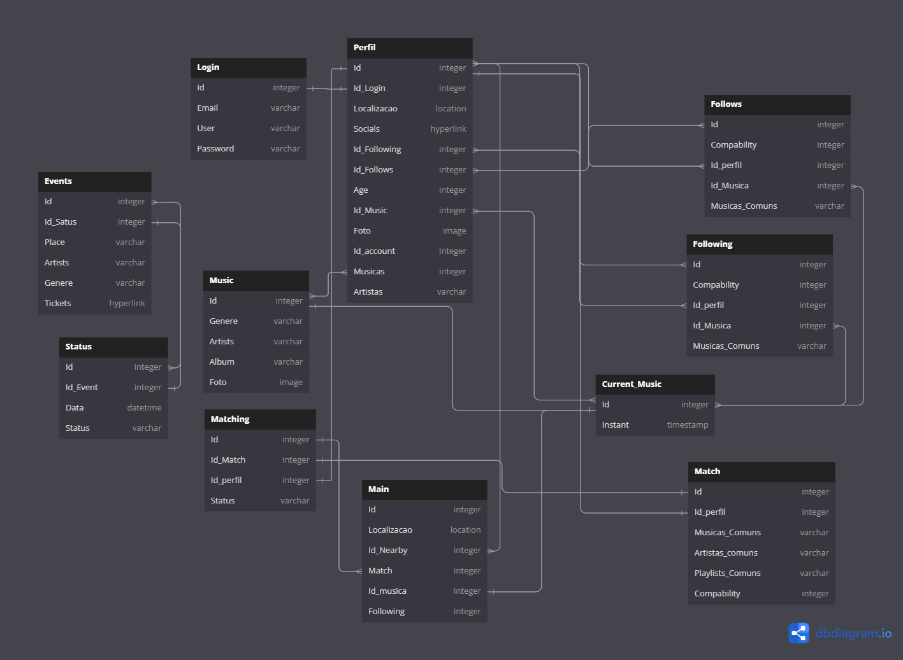
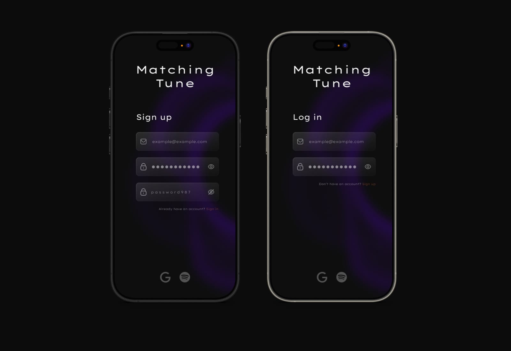
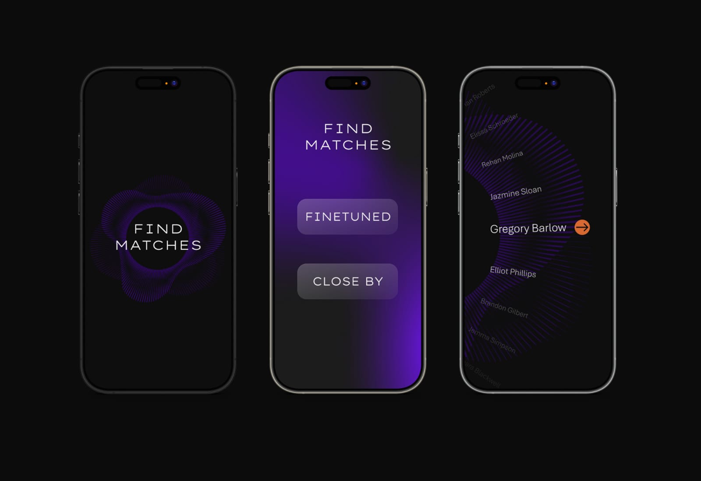
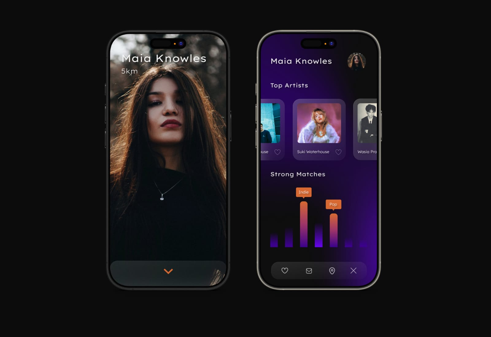

# Matchingtune - PROJETO 3º SEMESTRE 
#Música #Match #Aplicação #Pessoas #Eventos #Comunidade #Arredores #A Acontecer #Amigos

## **Uma proposta inicial de projeto:**
O _MatchingTune_ é um aplicativo onde se criam conexões apartir dos gostos musicais do utilizador. 
Conectando uma plataforma de streaming de música (_Spotify_, _YouTube Music_, _AppleMusic_, _SoundCloud_),
o _MatchingTune_ encontra utilizadores perto do usuário e em escala global, que ouçam as mesmas músicas, 
mesmos artistas e estilos de música. O _MatchingTune_ notifica também o utilizador de eventos perto de si. 
Sejam artistas que ouve ou de estilos de música semelhante ao que ouve, recomendando assim eventos que possam 
ser do interesse do utilizador.

### ***Permissões requisitadas:***
**Localização:** para poder encontrar eventos perto do usuário é preciso ter acesso a localização deste.
O _MatchingTune_ mostra também o que as pessoas à volta do utilizador estão a ouvir.
É preciso também trabalhar com o mapa, uma vez que solicitamos o lugar do evento, temos também que
ter acesso eventos em tempo real ou simulado; 

**Notificações:** Para o recurso de notificação de eventos funcionar bem, seria importante integrar informações
de forma precisa e atualizada sobre shows, festivais e eventos locais, o que pode exigir integração com múltiplas fontes;

**Contatos:** Existe também a funcionalidade de associar contatos e comparar gostos musicais entre estes. 
Sendo por isso necessária a permissão do utilizador para aceder aos seus contatos telefónicos e também a permissão 
para os seus contatos poderem ter acesso a esta funcionalidade sobre o usuário;

### Nome do projeto: _MatchingTune_

###  Enquadramento do projeto _(incluindo a ideia, uma pesquisa sobre o contexto em que se insere, descrição dos objetivos, definição do público-alvo e pesquisa sobre outras aplicações que já existam)_: 
O _MatchingTune_ pretende juntar os vários amantes da música entre eles apartir dos seus próprios gostos. Utilizando um algoritmo de associação entre utilizadores apartir das suas músicas guardadas, artistas ouvidos e playlists criadas. Num mundo onde cada vez mais a música se aproxima dos ouvintes, especialmente por concertos, o _MatchingTune_ indica também ao utilizador sobre eventos de música que podem ser do interesse do utilizador. Estas sugestões são feitas apartir dos eventos anunciados pelos artistas ouvidos e seguidos pelo utilizador e/ou também eventos perto do utilizador de estilos de música que este ouve.  

  A grande preocupação de jovens de hoje em dia é a união com outros com gostos e opiniões em comum. O _MatchingTune_ serve de plataforma que cria esta associação entre utilizadores para facilitar o caminho desafiante que este problema moderno apresenta aos jovens da atualidade. O objetivos principal do _MatchingTune_ é unir comunidades graças à música. Seja a união entre artistas e as suas respetivas comunidades, seja entre as comunidades entre si.
Apesar do desafio que o _MatchingTune_ pretende ultrapassar ser mais direcionado aos jovens, qualquer pessoa tem liberdade de utilizar a aplicação. ***É obrigatório para utlizadores menores de 18 anos terem a sua idade exposta no perfil.*** Apesar do _MatchingTune_ não ser diretamente concebida como uma aplicação de encontros românticos, é essencial manter a segurança dos utilizadores mais novos para impedir o contacto com possiveis predadores, por isto, todas as sugestões feitas a utilizadores menores de 18, serão extritamente com outros utilizadores menores de 18 (Uma possível funcionalidade seria a de verificação de idade apartir do cartão de cidadão, para qualquer idade, e não exclusivamente para maiores de 18 anos). Com exceção da proteção de menores na aplicação, o _MatchingTune_ não possuí nenhuma ferramenta para selecionar "filtros de interesse" para as sugestões de utlizadores feitas na aplicação. Ou seja, os únicos filtros existentes são apenas os gostos musicais em comum e se é maior ou menor de idade.

  Após uma extensa pesquisa, foi confirmado a existência de aplicações semelhantes ao _MatchingTune_ no seu conceito. No entanto, estas não estão disponíveis em Portugal, com a exceção do _TuneMeet_. Apesar disto, o _TuneMeet_ não só não é uma aplicação, mas sim um site, como apenas faz associações pela música atual que se está a ouvir, ou as cinco mais ouvidas. Sem ter em consideração a localização dos utilizadores, nem toda as suas músicas gostadas. Outras aplicações relevantes a mencionar são todas as plataformas de streaming que o _MatchingTune_ vai buscar as suas informações. A aplicação _Spotify_, apesar de não criar associações entre utilizadores, faz associações de eventos. Tendo na página de procura, uma opção para eventos ao vivo. Onde sugere eventos dos artistas que o utilizador ouve. Aparece também no perfil de artista

###  Uma versão preliminar com pelo menos três guiões de teste _(descrição textual passo a passo do progresso do utilizador na aplicação)_:
 - **1 caso de utilização que descreva o objeto "core" do projeto:**
 
 - **Outros 2 casos de utilização diferentes do "core" e entre eles _(podem partir do caso de utilização descrito anteriormente)_:**

###  Plano de trabalhos:

###  Project Charter and WBS (Documentação a explicar as várias funcionalidades):

###  Requisitos funcionais e não funcionais:
>**Requesitos Funcionais:**
>- Criação de Conta;
>
>- Inicio de Sessão;
>
>- Recuperação de Password;
>
>- Edição de Perfil (Imagem, nome de usuário, redes socias associadas/aparecem no perfil);
>
>- Edição de Conta (Alteração de email, alteração de password, plataformas de streaming associadas, redes socias associadas, estilo de localização(Fixa ou dinâmica), Dados Pessoais, Privacidade);
>
>- Procura de Eventos;
>
>- Procura de Usuários;
>
>- Ver perfil de usuários;
>
>- Seguir Usuário;
>
>- Aceitar Match;
>
>- Recusar Match;
>
>- Bloquear Usuário;
>
>- Comprar bilhetes (É redirecionado para o site de venda de bilhetes);
>
>- Visitar Redes Sociais do Usuário (É redirecionado para a aplicação ou para o site do perfil do utilizador).

>**Requisitos não Funcionais:**
>- Comparação entre Usuários (Idade (maior ou menor de idade), comparação das músicas gostadas, artistas ouvidos, playlists e albúns salvos);
>
>- Mostrar Músicas e Artistas favoritos no perfil;
>
>- Buscar informações às plataformas de streaming;
>
>- Mostrar as músicas que estão a ser ouvidas e o timestamp destas dos vários usuários;
>
>- Fazer sugestões de Usuários (Matches);
>
>- Fazer sugestões de Eventos (Baseado na localização, estilos de música do usuário, artistas ouvidos pelo usuário);
>
>- Rastreamento de localização;
>
>- Reunir informações sobre eventos.

##  Modelo do domínio:

##  Mockups e interfaces:

###  Planificação (Gráfico de Gantt):

### Descrição da solução a implementar, incluindo:

- Enquadramento nas diversas Unidades Curriculares: 

- Arquitetura da Solução (mesmo que provisória); 

- Tecnologias a utilizar (mesmo que provisória);

## Conclusão, incluindo objetivos a atingir: 

## Bibliografia (Sites utilizados):
